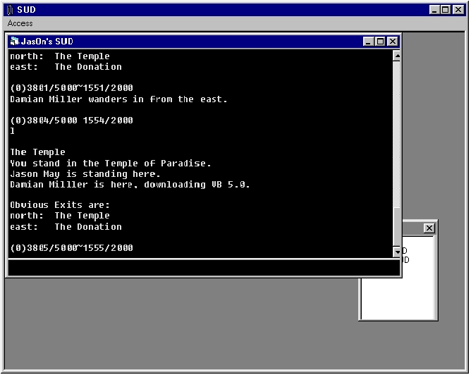



## JasOn's SUD\!

### Description

It has semi-A.I. (such as People moving around in random directions at a certain pace depending on the speed you set it to in the editor.

You can also carry objects and drop them in other rooms. You can also edit location descriptions and change their exits around. You can even add rooms :)
 
### More Info
 
I got the idea of a SUD (Single-User Dungeon) from something called a MUD (Multi-User Dimension). If you are confused, try out some MUDs by going to mudconnector.com and search for one.

True? lol

The battle system is a little buggy. Rarely, if you try to attack a mobile, you won't fight back.

It also tends to freeze up after a while.

             |
---                |---
**Submitted On**   |2001-11-11 13:23:46
**By**             |[N/A](https://github.com/Planet-Source-Code/PSCIndex/blob/master/ByAuthor/empty.md)
**Level**          |Intermediate
**User Rating**    |4.7 (14 globes from 3 users)
**Compatibility**  |VB 5\.0, VB 6\.0
**Category**       |[Files/ File Controls/ Input/ Output](https://github.com/Planet-Source-Code/PSCIndex/blob/master/ByCategory/files-file-controls-input-output__1-3.md)
**World**          |[Visual Basic](https://github.com/Planet-Source-Code/PSCIndex/blob/master/ByWorld/visual-basic.md)
**Archive File**   |[JasOn's\_SU3455411112001\.zip](https://github.com/Planet-Source-Code/jason-s-sud__1-28811/archive/master.zip)

